# SƠ ĐỒ CƠ SỞ DỮ LIỆU (DATABASE ERD DIAGRAM)

Sơ đồ này mô tả chi tiết các thực thể (entities), thuộc tính (attributes) và mối quan hệ (relationships) trong hệ thống Headless CMS (NestJS + PostgreSQL) của website Kỷ niệm 25 năm Khoa CNTT. 

Đặc biệt, sơ đồ làm nổi bật kiến trúc để xây dựng tính năng **Dynamic Form** linh hoạt cho các sự kiện khác nhau (Form đăng ký, Form gửi lời chúc, Form khảo sát...).

```mermaid
erDiagram
    %% ==========================================
    %% 1. TÀI KHOẢN & QUẢN TRỊ 
    %% ==========================================
    User {
        string id PK "UUID"
        string email UK "Email đăng nhập"
        string password "Mật khẩu mã hoá (Bcrypt)"
        string role "SUPER_ADMIN, EDITOR, AUTHOR"
        string name "Họ và tên"
        string avatar "Link ảnh đại diện (optional)"
        datetime createdAt "Ngày tạo tài khoản"
        datetime updatedAt "Ngày cập nhật cuối"
    }

    %% ==========================================
    %% 1.1 AUDIT LOGS (GIÁM SÁT HỆ THỐNG - DÀNH CHO SUPER_ADMIN)
    %% ==========================================
    AuditLog {
        string id PK "UUID"
        string userId FK "ID User thực hiện hành động"
        string action "Loại thao tác (CREATE, UPDATE, DELETE...)"
        string entity "Tên bảng thao tác (Article, Media, User...)"
        string entityId "ID của record bị tác động"
        json oldValues "Dữ liệu trước khi sửa/xoá"
        json newValues "Dữ liệu mới"
        string ipAddress "IP của user thực hiện"
        datetime createdAt "Thời gian thi hành"
    }

    %% ==========================================
    %% 2. TÀI NGUYÊN MEDIA & THƯ VIỆN CHỦ ĐỀ (S3 - MinIO)
    %% ==========================================
    MediaAlbum {
        string id PK "UUID"
        string title "Tên chủ đề / giai đoạn ảnh (VD: Hội thao Khoa 2012)"
        string slug UK "URL chuẩn SEO"
        text description "Mô tả Album"
        string coverPhotoId "ID Ảnh bìa Album (tham chiếu Media)"
        
        %% === SEO Metadata ===
        string metaTitle "SEO Title cho trang xem ảnh"
        string metaDescription "SEO Description"
        
        string createdBy FK "Người tạo (Chỉ EDITOR/SUPER_ADMIN)"
        datetime createdAt
        datetime updatedAt
    }

    Media {
        string id PK "UUID"
        string albumId FK "Optional: File này thuộc chủ đề nào? (Null nếu là ảnh tự do)"
        string key UK "Object key lưu trên MinIO S3"
        string url "Đường dẫn truy cập public"
        string fileName "Tên file gốc"
        string mimeType "Kiểu định dạng (image/png, application/pdf...)"
        int size "Kích thước file (bytes)"
        string category "IMAGE, VIDEO, PDF_YEARBOOK, ATTACHMENT"
        string uploadedBy FK "Người tải lên (User ID)"
        datetime createdAt "Ngày upload"
    }

    %% ==========================================
    %% 3. QUẢN LÝ NỘI DUNG (TIN TỨC, SỰ KIỆN & SEO)
    %% ==========================================
    Article {
        string id PK "UUID"
        string title "Tiêu đề bài viết"
        string slug UK "URL thân thiện cho SEO (VD: bai-viet-su-kien-a)"
        string summary "Tóm tắt ngắn (Dùng hiển thị dạng Card)"
        text content "Nội dung bài viết (HTML/Rich-Text)"
        string thumbnail "URL Ảnh bìa chính thức"
        string category "NEWS (Tin tức), EVENT (Sự kiện)"
        string authorId FK "Người viết bài / Admin tạo bài"
        
        %% === SEO Metadata ===
        string metaTitle "SEO Title (Mặc định lấy Title)"
        string metaDescription "SEO Description"
        string focusKeywords "Từ khóa SEO (VD: 'kỷ niệm, cntt hcmute')"
        
        %% === Trạng thái và Ngày giờ ===
        string status "DRAFT (Bản nháp), PUBLISHED (Phát hành), ARCHIVED (Lưu trữ)"
        int viewCount "Số lượt xem bài viết"
        boolean isPinned "Có ghim lên đầu trang chủ không?"
        datetime publishedAt "Thời gian cho phép hiển thị public"
        datetime createdAt
        datetime updatedAt
    }

    %% ==========================================
    %% 4. HÀNH TRÌNH 25 NĂM & THÀNH TỰU
    %% ==========================================
    Milestone {
        string id PK "UUID"
        int year "Năm diễn ra sự kiện (VD: 2005)"
        string title "Tên cột mốc"
        text description "Mô tả chi tiết"
        string image "URL Hình ảnh"
        int order "Thứ tự sắp xếp hiển thị trên Frontend"
        datetime createdAt
    }

    Achievement {
        string id PK "UUID"
        string title "Tiêu đề (VD: Số lượng sinh viên, Bài báo)"
        text description "Mô tả ý nghĩa"
        string category "Đào tạo, Nghiên cứu, Hợp tác quốc tế..."
        json metrics "Dữ liệu dạng JSON chứa thông số (VD: {value: 300, unit: 'Sinh viên'})"
        int order "Vị trí sắp xếp"
        datetime createdAt
    }

    Alumni {
        string id PK "UUID"
        string name "Tên Cựu sinh viên"
        string course "Khoá học (VD: Khoá 2008)"
        string position "Chức vụ hiện tại"
        string company "Nơi công tác"
        text quote "Lời chia sẻ, trích dẫn"
        string avatar "URL Ảnh chân dung"
        int order "Thứ tự hiển thị"
        datetime createdAt
    }

    %% ==========================================
    %% 5. DYNAMIC FORM (FORM ĐỘNG TÙY BIẾN CHO CMS)
    %% ==========================================
    FormDefinition {
        string id PK "UUID"
        string title "Tên của Form (VD: Form gửi lời chúc 25 năm)"
        string slug UK "Mã nhận diện form"
        text description "Mô tả hướng dẫn điền form"
        string eventId FK "Optional: Liên kết đến Bài viết sự kiện (Article ID)"
        boolean active "Form đang mở hay đóng"
        datetime createdAt
        datetime updatedAt
    }

    FormField {
        string id PK "UUID"
        string formId FK "Mã FormDefinition"
        string name "Key lưu trữ (VD: full_name, email, file_upload)"
        string label "Tên hiển thị (VD: Họ và tên của bạn)"
        string type "Định dạng nhập liệu: TEXT, TEXTAREA, EMAIL, PHONE, SELECT, RADIO, CHECKBOX, FILE"
        boolean required "Bắt buộc điền hay không?"
        json options "Cấu hình mở rộng: Cung cấp list option cho SELECT/RADIO (VD: ['K20', 'K21'])"
        int order "Thứ tự hiển thị trường nhập trên trình duyệt"
    }

    FormSubmission {
        string id PK "UUID"
        string formId FK "Mã FormDefinition"
        json data "Lưu trữ toàn bộ thông tin User Submit dạng JSON key-value (Map với tên của FormField)"
        datetime createdAt "Ngày giờ nộp form"
    }

    %% ==========================================
    %% KHAI BÁO MỐI QUAN HỆ KHÓA NGOẠI (RELATIONSHIPS)
    %% ==========================================
    
    %% Mối quan hệ của User (Admin/Editor/Author)
    User ||--o{ Article : "đăng bài viết (1-N)"
    User ||--o{ AuditLog : "sinh ra log (1-N)"
    User ||--o{ Media : "upload file (1-N)"
    User ||--o{ MediaAlbum : "tạo bộ ảnh sự kiện (1-N)"
    
    %% Mối quan hệ Thư viện Ảnh
    MediaAlbum ||--o{ Media : "chứa các file hình ảnh/video (1-N)"
    
    %% Mối quan hệ Dynamic Form
    FormDefinition ||--o{ FormField : "có danh sách field (1-N)"
    FormDefinition ||--o{ FormSubmission : "nhận lượt nộp bài (1-N)"
    Article |o--o| FormDefinition : "Optional: sự kiện có thể có 1 form đăng ký"

```

## Giải thích chi tiết một số Table quan trọng
- **`User` (Phân quyền 3 level):** `SUPER_ADMIN` (được đọc bảng `AuditLog` và quản lý users), `EDITOR` (tùy ý CRUD `MediaAlbum` và bài viết), `AUTHOR` (chỉ thao tác được các bài viết nơi `Article.authorId` khớp với ID của họ).
- **`AuditLog`**: Tính năng cốt lõi cho ứng dụng ban quản trị, tracking lại lịch sử thay đổi thông qua vòng đời (Lifecycle hooks) của Backend NestJS interceptor. Lưu lại trạng thái `oldValues` và `newValues` dễ dàng audit lại sai sót (Ví dụ: ai lỡ tay xoá bài). 
- **`Media` & `MediaAlbum`**: Tách bạch MinIO S3 File upload (`Media`) và logic tổ chức tập tin theo sự kiện (`MediaAlbum`). Frontend khi gọi `Album` sẽ tận dụng cấu trúc SEO (`slug`, `metaTitle`) để index bộ ảnh lên Google Images cực chuẩn.
- **`FormDefinition` & `FormField`**: Khi admin Backend tạo form "Tri ân" có 3 trường (Họ tên, Khóa, Lời chúc) thì Backend sẽ tạo 1 row `FormDefinition` kèm với 3 rows tương ứng ở dạng schema `FormField`.
- **`FormSubmission`**: Record JSON này giải quyết việc lưu data không ràng buộc số lượng cột. Admin tạo bao nhiêu Field thì data Object sẽ serialize tự động và map chính xác.
