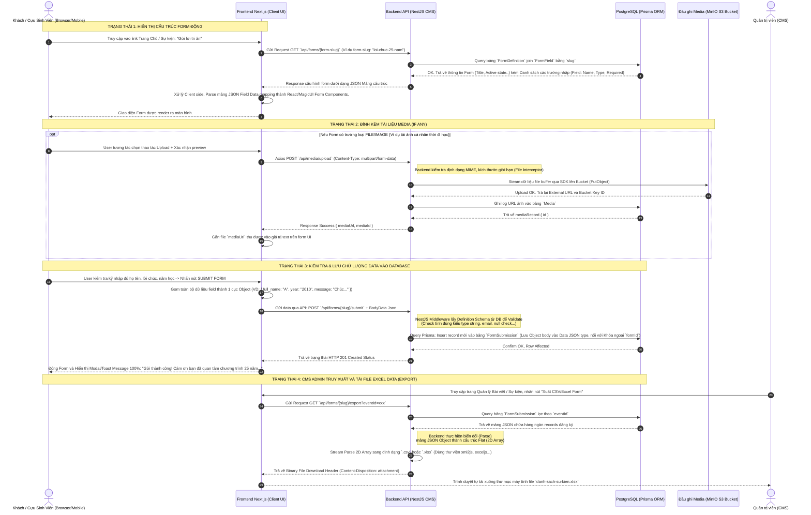

# SƠ ĐỒ TUẦN TỰ LƯU TRỮ VÀ XỬ LÝ DYNAMIC FORM (SEQUENCE DIAGRAM)

Sequence Diagram dưới đây chỉ ra chi tiết luồng Request/Response chuẩn trong hệ thống tính từ lúc Client load giao diện, User điền thông tin form và upload hình (nếu có), cho đến khi Backend NestJS lưu trữ data một cách đồng bộ xuống Database.

## Các thành phần cốt lõi được triển khai trong luồng
- **Type Checking Dynamically:** Backend NestJS không hardcode các trường (họ tên, email). Việc Validate nằm việc map thông số `type` và `required` lấy từ `FormField` dưới DataBase thay vì Class Validator truyền thống của NestJS.
- **Micro Storage Layer Context:** Hệ thống Upload (MinIO S3) được bóc tách hoàn toàn độc lập với form submit. File tải lên trước, Backend nhận link sau đó chèn link URL vào Form JSON data, cuối cùng mới submit JSON data thành record cuối, đảm bảo không rớt dữ liệu văn bản nếu ảnh load quá nặng.
- **Client Render (NextJS):** Component form của NextJS sử dụng kỹ thuật Render Engine động đọc config JSON và vòng lặp `map()` hiển thị component Input, Select hay Checkbox có sẵn của hệ thống UI mà không cần can thiệp code cứng.
- **Stream Excel Pipeline:** Thay vì để Frontend tải một cục JSON vài Megabytes về rồi mới xuất Excel làm treo trình duyệt Máy tính của Admin, luồng hiện tại đẩy toàn bộ gánh nặng Parse `JSON` -> `Excel` cho CPU của NestJS Backend và stream file nhị phân về.
