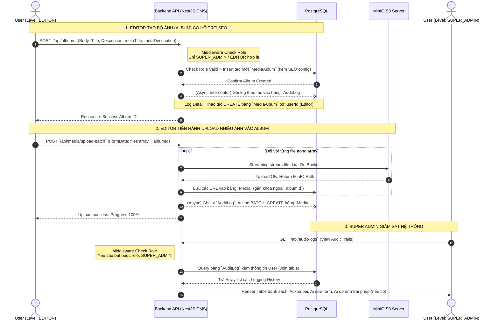

# SƠ ĐỒ TUẦN TỰ THƯ VIỆN ẢNH VÀ AUDIT LOG (SEQUENCE DIAGRAM)

Biểu đồ này minh hoạ quá trình Editor tạo một Bộ thư viện ảnh/chủ đề sự kiện (Media Album), thiết lập chuẩn SEO và upload hàng loạt ảnh. Đồng thời, sơ đồ thể hiện ngầm hệ thống NestJS tự bắt log (Audit Logging) và lưu vết cho Super Admin kiểm soát.

## Các điểm thiết kế hệ thống đáng giá:
1. **RBAC Middleware (Phân quyền):** NestJS Guard Role-Based Access Control kiểm soát chặn đứng nếu một Author lấy token API để tự tạo Album sự kiện (HTTP 403 Forbidden).
2. **Audit Interceptor (Lưu vết không xâm lấn Code main logic):** Logic lưu log `AuditLog` được đặt ở Interceptor hoặc Prisma Middleware. Cứ có query thay đổi DB thì DB Listener tự bắt được Request IP, Auth ID và diff JSON Data để ném vào bảng `AuditLog` một cách bất đồng bộ (`Async`), **không làm chậm thời gian chờ phản hồi của API Editor**.
3. **Batch Upload Streamer:** Tích hợp trực tiếp MinIO qua stream, không lưu file tạm (temp file) trên đĩa cứng của server giúp bảo đảm máy chủ backend không bị nghẽn ổ đĩa Cấu hình.
