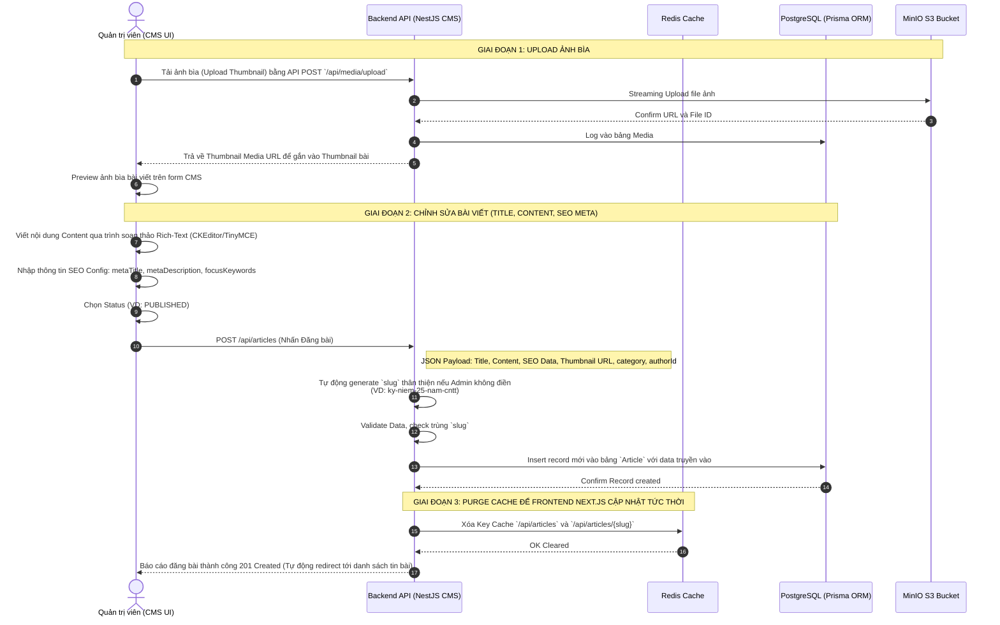

# SƠ ĐỒ TUẦN TỰ ĐĂNG BÀI TIN TỨC CHUẨN SEO (SEQUENCE DIAGRAM)

Sequence Diagram dưới đây chỉ ra chi tiết luồng xử lý riêng biệt cho chức năng **Admin Đăng Bài Có Cấu Hình SEO**. Flow này đảm bảo bài viết được upload hình ảnh chuẩn, nội dung lưu trữ tối ưu hóa cấu trúc SEO và phục vụ mượt mà trên NextJS.

## Các thành phần cốt lõi được triển khai trong luồng Đăng Bài (Article Flow)
- **Tách biệt Cache bằng Redis:** Khi Admin đăng 1 bài viết hoặc chỉnh sửa bài viết đã có trên DB, NestJS sẽ tự động gửi lệnh Delete Cache (`Invalidation`) trên Redis (cục bộ hoặc gửi API revalidate tới Next.js ISR) để đảm bảo Client luôn nhận được tin tức mới lập tức sau vài giây publish.
- **Auto-Generate SEO Slug:** Khi admin chỉ nhập tên bài viết, backend tự động handle logic chuẩn hóa Tiếng Việt có dấu thành `chiendich25nam` ở cấp API trước khi query insert Database, giúp URL thân thiện với Google Search.
- **Micro Storage (MinIO):** Upload ảnh Thumbnail bài viết diễn ra trước, Admin lấy link ảnh preview trước khi bấm nút Publish bài, tiết kiệm RAM Memory trên Backend thay vì post cả string article + file vào cùng 1 body req.
